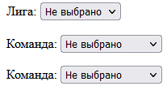
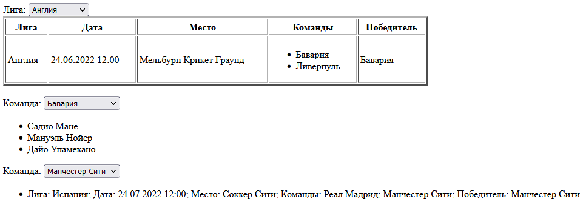

# Лабораторная работа №2

## Техническое задание
**Вариант 7**. Создать и заполнить БД футбольного чемпионата. В базе представлены две коллекции - коллекция документов, описывающая команды (название, тренер, состав команды (массив футболистов)), и коллекция, содержащая документы, которые описывают игры чемпионата (лига, дата и место проведения, команды-участницы игры, победитель и т.д.).

Предоставить пользователю возможность получения следующей информации:

- таблица чемпионата для выбранной лиги;
- список футболистов указанной команды; 
- список игр, в которых участвовала выбранная команда.

## Скрины

> Форма без данных
---

> Форма с данными
---
> В localStorage сохраняется предыдущий выбранный пункт из списка лиг